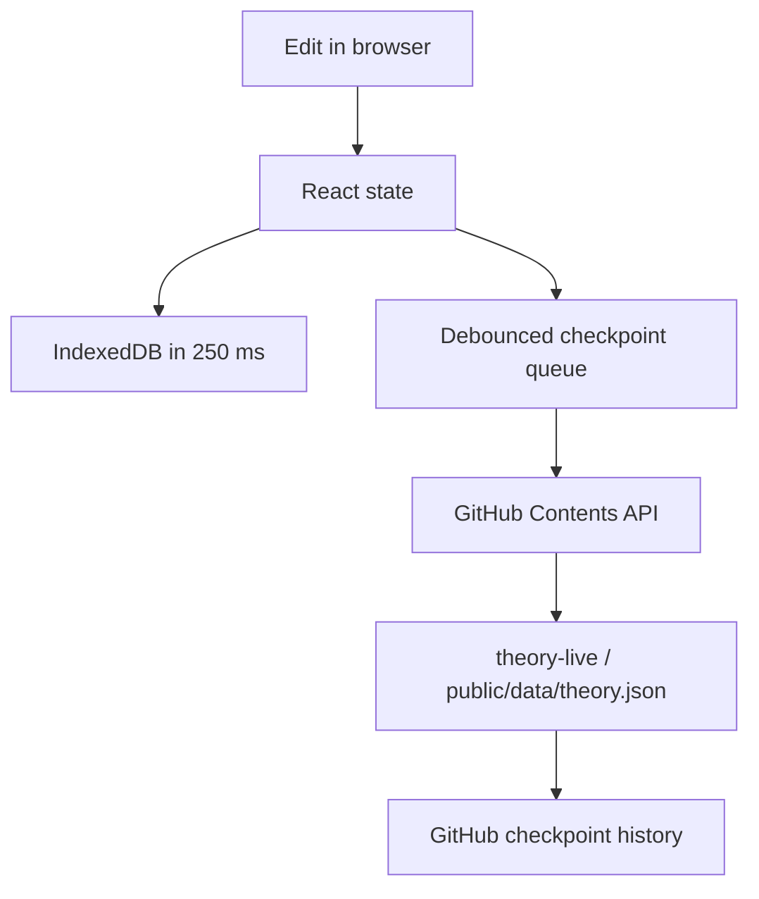
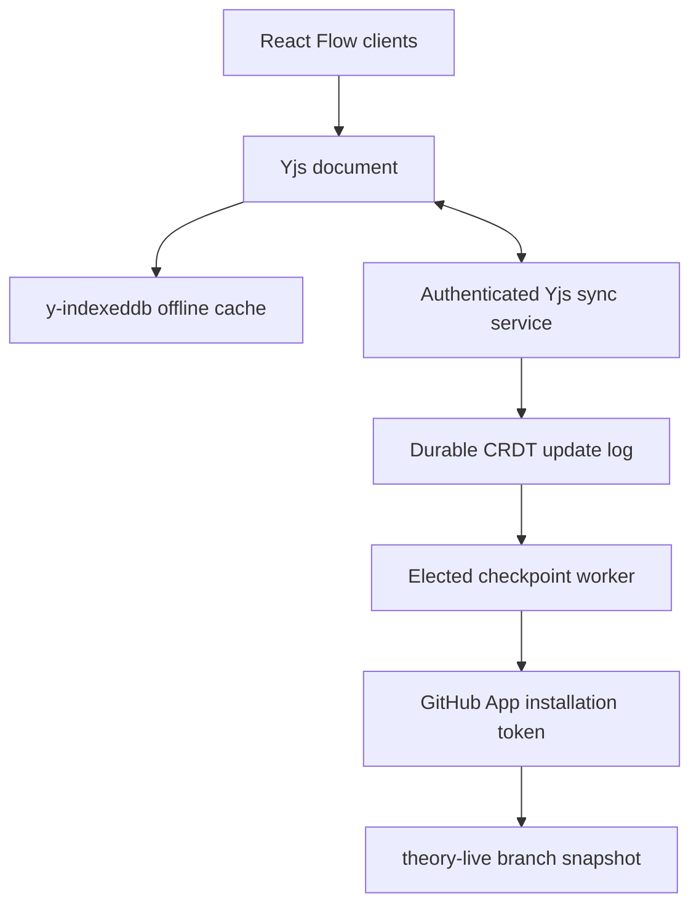

# Persistence and collaboration architecture

## Current owner-only implementation

The first durability boundary is the local device. GitHub is a serialized checkpoint layer, not a keystroke database.

- Local persistence: 250 ms debounce
- GitHub idle debounce: 6 seconds
- Minimum checkpoint interval: 15 seconds
- Token: fine-grained, repository-limited, session storage only
- Data branch: `theory-live` (does not trigger the Pages deployment workflow)
- Concurrency: one outbound write at a time
- Optimistic locking: GitHub blob SHA
- Conflict: stop, retain both, offer merge / local / GitHub review choices
- Normal deletion: reversible archive (`Return to Ether`)

This is appropriate for one primary editor. It is not a safe anonymous-write architecture.

## Recommended shared live architecture

For simultaneous editors and instant multi-device convergence:

### Security boundary

GitHub Pages is static. It cannot safely hold a GitHub App private key or client secret. A small trusted service should:

1. Authenticate through a GitHub App installed only on `dream-unity/theory`.
2. Check an editor allowlist or repository collaborator permission.
3. Issue a short-lived, HttpOnly, Secure, SameSite session or WebSocket ticket.
4. Retain the installation credential exclusively server-side.
5. Persist and fan out granular Yjs updates.

### CRDT structure

Nodes should be separate `Y.Map` values and long text should be `Y.Text`. Edges, views, and view positions should also be granular shared structures. Storing the entire theory as one opaque JSON string would sacrifice meaningful concurrent merging.

Presence, cursors, selections, and current viewport belong to Yjs Awareness and should not be persisted.

### GitHub checkpoint worker

Use one elected writer. Serialize deterministic JSON after roughly 20 seconds idle, no more than once per minute, with a maximum delay during continuous work and an explicit “Checkpoint now.” Keep live updates and GitHub deployment triggers separate so every theory edit does not rebuild the application.

For a single snapshot file, use the Contents API with the known current SHA. If data later becomes multiple Markdown/entity files, create blobs and one Git tree, create one commit, then fast-forward the data branch ref with `force: false`.

### Conflict policy

An externally modified canonical theory file must not be silently resolved by timestamps. Pause checkpointing, preserve the live Yjs state, fetch the external version, and present an explicit import/review flow. A data branch owned by the checkpoint app makes this exceptional.

## Deployment

The included GitHub Actions workflow builds Vite with base `/theory/` and deploys `dist/` to GitHub Pages. It requests only:

- `contents: read`
- `pages: write`
- `id-token: write`

The repository is currently public, so the published theory is public. Do not put confidential legal, medical, or private personal material into the atlas unless the storage and publication model is deliberately changed.
